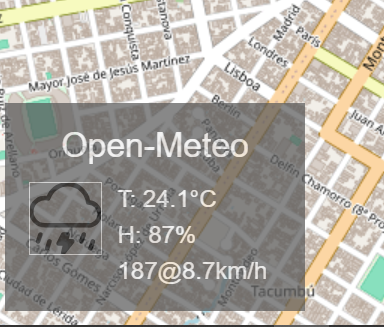

# Leaflet.OpenMeteo
A [leaflet](https://leafletjs.com) plugin to display weather using
the [Open-Meteo API](https://www.open-meteo.com).  It was inspired by
the [ Leaflet.Weather ](https://github.com/oskosk/Leaflet.Weather) plugin.  
Primary differences are that Leaflet.OpenMeteo has no dependancies 
(no JQuery), the Open-Meteo api doesn't require an API key (for non-
commerial use), and (hopefully) will be Leaflet version 2 compatible. 

[](./screenshot.png)

## Example
``` javascript
    // Create a map in the "map" div, set the view to Berlin
     map = new L.Map('map').setView([52.5, 13.4], 13);

    // add an OpenStreetMap tile layer
    new L.TileLayer('https://{s}.tile.osm.org/{z}/{x}/{y}.png').addTo(map);

    // add the weather control that displays the weather at the center of the map
    new L.Control.OpenMeteo().addTo(map);

    // You can add multiple instances.
    // Add a control for London
    new L.Control.OpenMeteo({
        title: "London",
        center: [51.5, -0.1],
    }).addTo(map);
```

## Installation
Just include the JS in your HTML.  The CSS is in the javascript file.  The method used to inject the CSS might (or might not) work on non-evergreen browsers.
```html
    <script src="Leaflet.OpenMeteo.min.js"></script>
```

### Options
* `position` - Leaflet [position option](https://leafletjs.com/reference.html#control-position) for Controls.
* `title` - Title for control.  Defaults to "OpenMeteo".  Useful when creating multiple instances.
* `location` - Not to be confused with `position`, this is the lat/lng from where you want the weather.  Defaults to the center of the map.  Useful when creating multiple instances.
* `wind_directions` - options are:
  * if undefined or ommitted, wind direction displayed in degrees
  * an array of strings representing evenly spaced directions (starting at north, rotating clockwise).  You can use this to get directons like "NNE", or things like `["Βορέας", "Εὖρος", "Νότος", "Ζέφυρος"]` if you're an ancient Greek sailor.
  * `default` - a pre-defined array `[ "N", "NE", "E", "SE", "S", "SW", "W", "NW" ]`

## Weird design choices
* The cool kids these days say "don't use webfonts, use SVG's".  I'm not sure I agree, but I'm trying it out in this project.  Turns out I've got a lot to learn about how to use SVG's, but I'll get there.  Feel free to tweak it.
* Putting the CSS right in the javascript file and using [adoptedStyleSheets](https://caniuse.com/?search=adoptedStyleSheets).  Only one file to load or customize, and Leaflet version 2 doesn't plan to support broken browsers, so this seemed like the way to go.

## License
The Leaflet.OpenMeteo plugin is released under the [MIT License](https://opensource.org/license/mit)<br/>
The weather images were taken from [XXX](https://github.com/xxx/yyy) and are licenced under the terms of [XXX](https://opensource.org/license/xxx)<br/>
The [Open-Meteo API](https://open-meteo.com/en/pricing) has a tiered license, which you should check out if you plan on deploying this plugin in a commerical setting.
